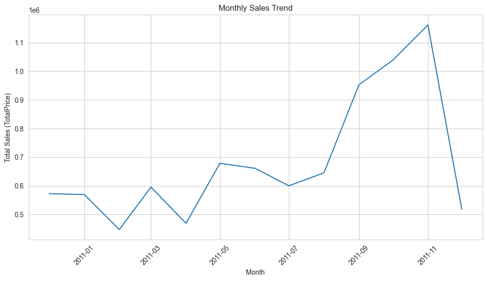
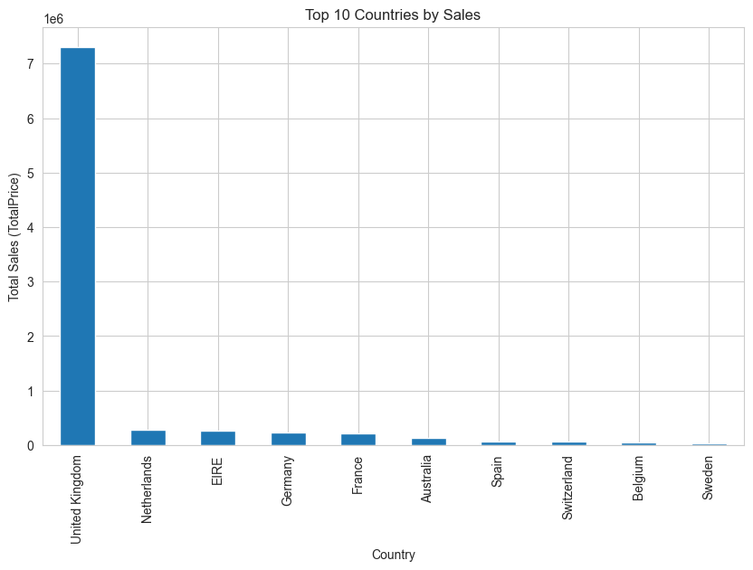
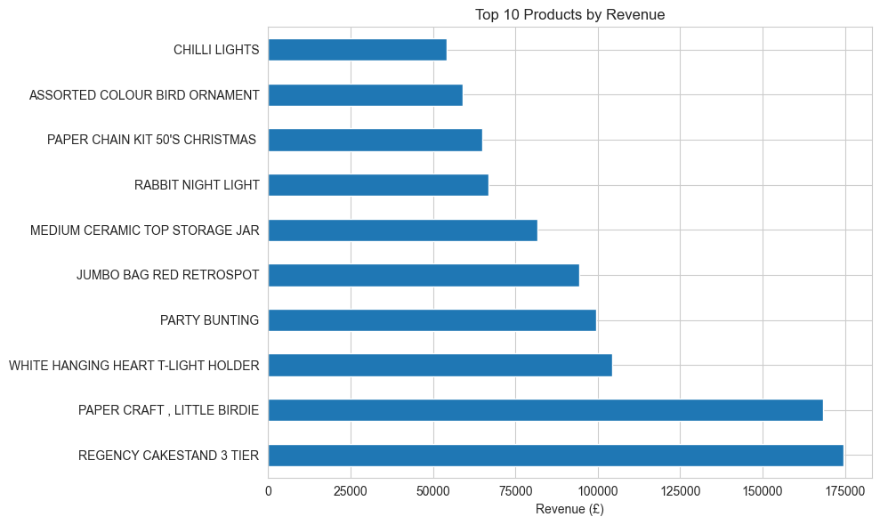
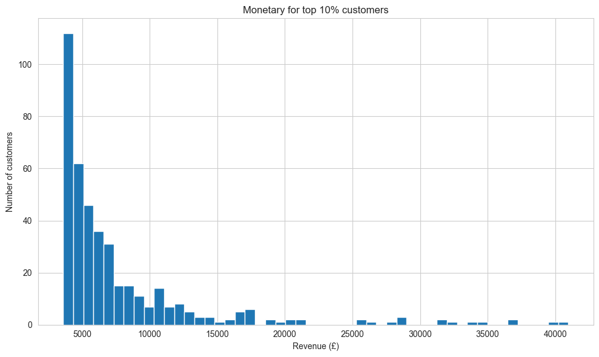

## Business Insights

**📅 Seasonality:**  
  The monthly sales plot shows clear peaks in October and November.  
  This suggests a strong opportunity for seasonal marketing campaigns.

  

**🌍 Key countries:**  
  A large portion of sales comes from United Kingdom. Other countries with high sales are Netherlands, Ireland, Germany, France and Australia.  
  It is worth increasing marketing and logistics efforts in these regions.

  

**🛍️ High‑value products:**  
  A small number of products generate a significant share of revenue.  
  These products are ideal candidates for:
  - cross‑selling recommendations,
  - bundles and promotions,
  - product placement on the homepage.

  

**👥 Top 10% customers:**  
  10% of customers generate a very large share of total revenue.  
  This group can be targeted with:
  - loyalty programs,
  - personalized offers,
  - churn‑prevention strategies.

  

This project demonstrates how simple pandas analyses can deliver clear business value.
